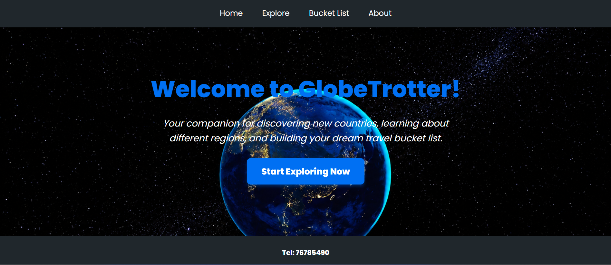
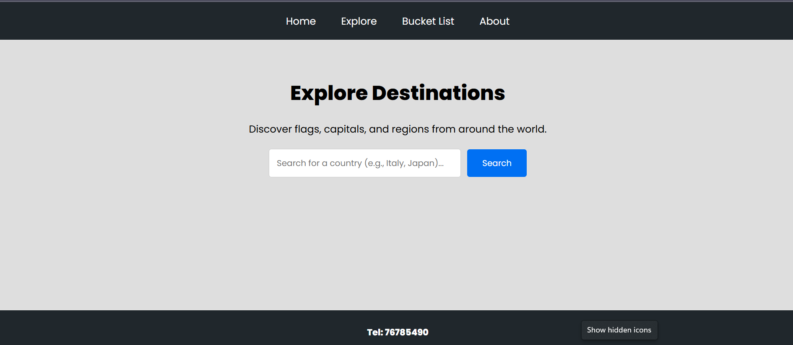
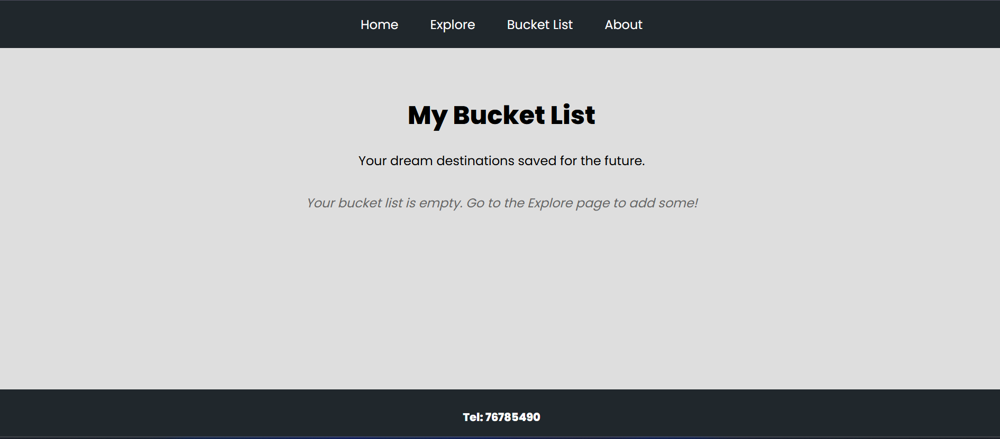

# GlobeTrotter

GlobeTrotter is a modern, responsive React Single Page Application (SPA) that allows users to explore data from all over the world using the REST Countries API and to make a personal travel bucket list.

## Live Demo
Check out the live deployment here: https://globetrotter-swart-five.vercel.app/
## Acknowledgements
This project was developed as an academic assignment utilizing the starter template provided by the course professor. Core routing, API integration, data persistence features, and custom visual styling were implemented independently on top of the base template structure.

## Features
**Dynamic Routing:** Seamless, refresh-free page switching using React Router DOM.
**Live API Integration:** Fetches real-time country details (flags, capitals, population, regions) from the REST Countries API.
**Persistent Storage:** Uses browser `localStorage` to save and modify a custom travel bucket list that survives page refreshes.
**Modern UI Polish:** Styled with standard pixels, and the 'Poppins' Google Font.

## Technologies Used
React.js (Frontend library)
React Router DOM (Client-side routing)
REST Countries API (Data fetching)
LocalStorage API (Data persistence)
Vanilla CSS (Global and inline styling)

- Home Screen:

- Explore Page:
  

-Bucket List Page:
  